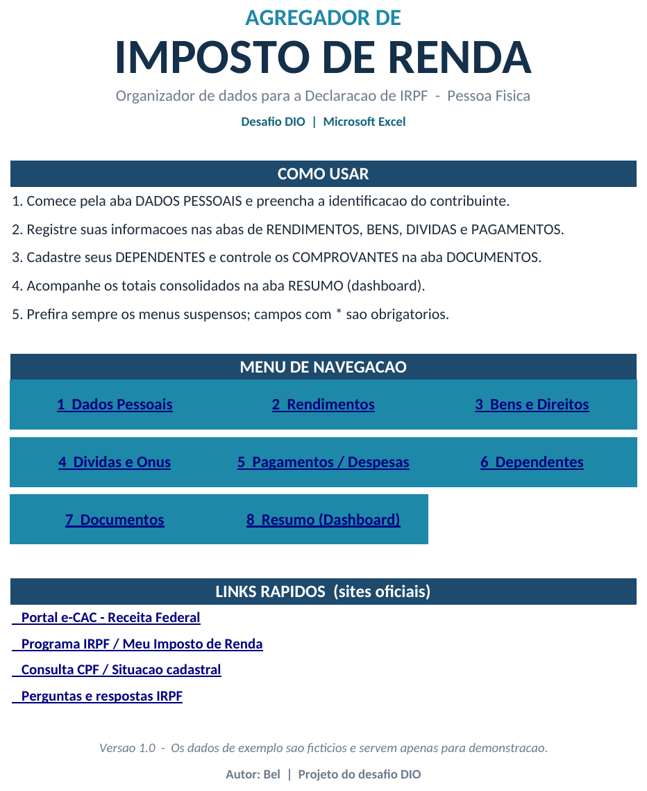
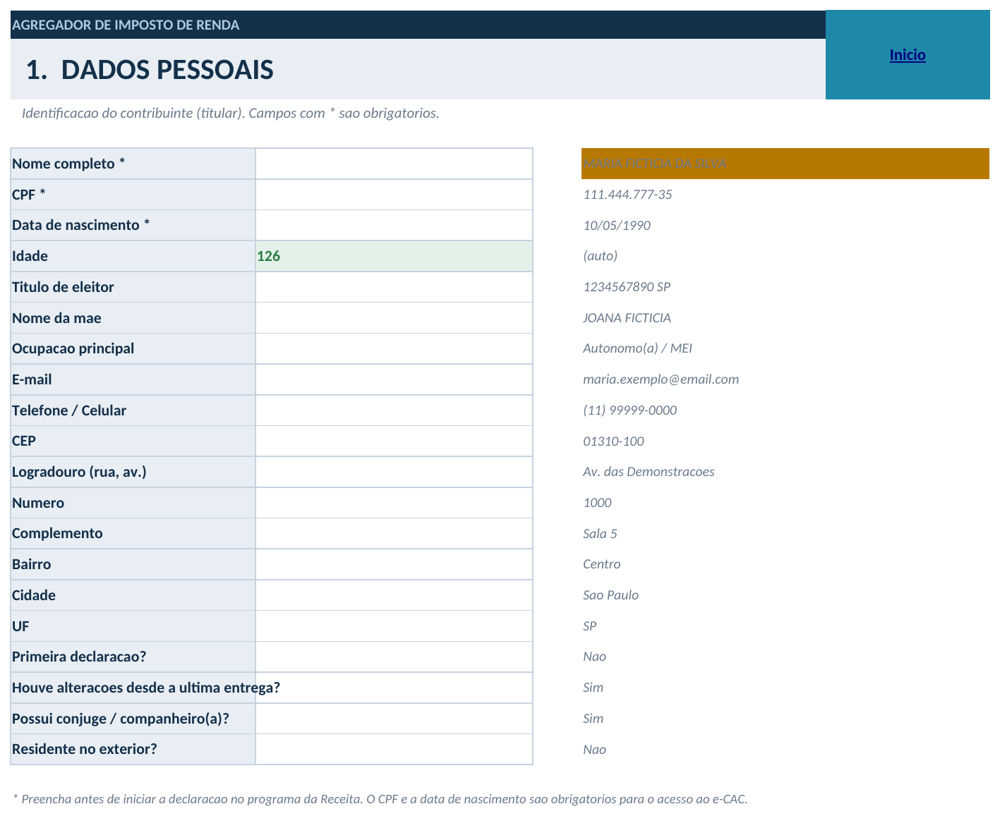
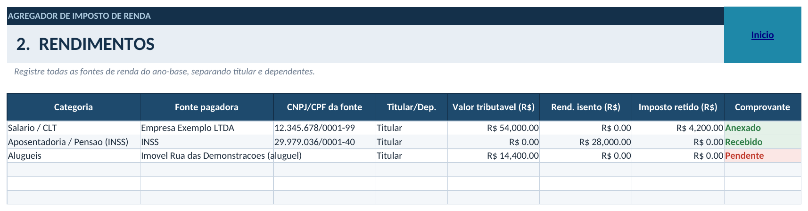
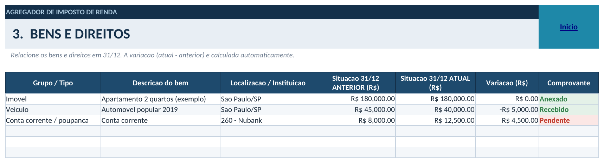
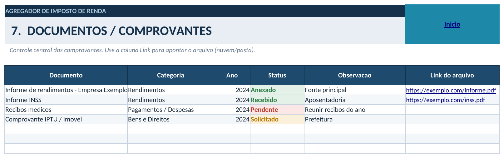
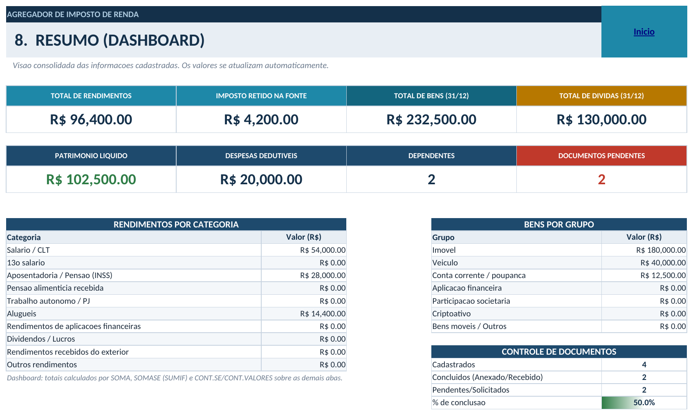

# 📊 Agregador de Imposto de Renda — Excel

> Ferramenta em Microsoft Excel para **organizar e reunir as informações essenciais da Declaração de Imposto de Renda Pessoa Física (IRPF)** — com menus de navegação, validação de dados, tabelas estruturadas, fórmulas automáticas e um dashboard consolidado.

Projeto desenvolvido para o desafio de projeto da **[DIO](https://www.dio.me/)**.

---

## 🎯 Descrição

Todo ano, na época da declaração de IR, o contribuinte precisa reunir informações que estão **espalhadas** em vários lugares: informes de rendimentos, comprovantes de bens, saldos de dívidas, recibos médicos e de educação, dados de dependentes, etc. Perder um comprovante ou esquecer uma fonte de renda gera erro, malha fina ou retificação.

Esta planilha resolve isso funcionando como um **agregador de dados**: um único arquivo onde o usuário registra, de forma **validada e organizada**, tudo o que vai precisar na hora de preencher o programa da Receita Federal. A entrada de dados é guiada por **listas suspensas** e **regras de validação**, e o **dashboard** mostra os totais consolidados em tempo real.

**Para quem foi desenvolvido:** qualquer pessoa física que faça a própria declaração de IR e queira se organizar ao longo do ano, sem depender de planilhas soltas ou anotações em papel.

---

## 🏆 O desafio

O desafio da DIO propõe **criar uma ferramenta no Excel** que ajude a organizar as informações do Imposto de Renda, aplicando na prática os conceitos das aulas: menus de navegação, validação de dados, campos estruturados, funcionalidades automáticas, links rápidos, interface amigável e documentação/publicação no GitHub.

A partir dos materiais de apoio (script de alinhamentos, banco de bancos e projeto de referência), o objetivo é **projetar uma solução própria** — não copiar o projeto de referência — mantendo os requisitos essenciais e propondo melhorias que deixem o resultado mais profissional.

---

## 🎯 Objetivos

- Centralizar em um único arquivo todas as informações necessárias para a declaração de IRPF.
- Reduzir erros de digitação com **validação de dados** e **listas suspensas**.
- Automatizar totais e indicadores com **fórmulas nativas** do Excel.
- Oferecer **navegação intuitiva** entre as seções (menu + botões "Início").
- Controlar o **status dos comprovantes** (pendente, solicitado, recebido, anexado).
- Consolidar tudo em um **dashboard** de leitura rápida.

---

## ⚙️ Funcionalidades

- ✅ **Menu de navegação** com hyperlinks para todas as abas e botão **"Início"** em cada seção.
- ✅ **Links rápidos** para sites oficiais (e-CAC, Meu Imposto de Renda, consulta de CPF, perguntas e respostas).
- ✅ **Validação de dados** (listas suspensas) em categorias, UF, parentesco, status, Sim/Não, titular/dependente, etc.
- ✅ **Formatação específica** de CPF, CEP, datas e moeda (R$).
- ✅ **Tabelas estruturadas** (com filtro e linhas zebradas) nas abas de lançamento.
- ✅ **Cálculo automático** de idade (`DATEDIF`), variação patrimonial e amortização de dívidas.
- ✅ **Totais automáticos** por aba (`SOMA`) e **quebra por categoria** no dashboard (`SOMASE`).
- ✅ **Indicadores** de dependentes, documentos cadastrados/pendentes e **% de conclusão** (`CONT.SE` / `CONT.VALORES`).
- ✅ **Formatação condicional**: status dos documentos por cor e **barra de dados** no percentual de conclusão.
- ✅ **Dados de exemplo fictícios** e coerentes, apenas para demonstração.

---

## 🗂️ Estrutura da ferramenta

| # | Aba | Função |
|---|-----|--------|
| 🏠 | **INÍCIO** | Capa, instruções de uso, menu de navegação e links rápidos oficiais. |
| 1 | **DADOS PESSOAIS** | Identificação do contribuinte (nome, CPF, nascimento, endereço, ocupação). Idade calculada automaticamente. |
| 2 | **RENDIMENTOS** | Fontes de renda por categoria (salário, aposentadoria, aluguéis, autônomo…), com valor tributável, isento e imposto retido. |
| 3 | **BENS E DIREITOS** | Imóveis, veículos, contas, aplicações, participações e criptoativos, com situação em 31/12 e variação automática. |
| 4 | **DÍVIDAS E ÔNUS** | Financiamentos, empréstimos e demais dívidas, com saldo em 31/12 e valor amortizado no ano. |
| 5 | **PAGAMENTOS** | Despesas dedutíveis (médicas, educação, previdência, pensão), com titular/dependente e comprovante. |
| 6 | **DEPENDENTES** | Cadastro dos dependentes, com CPF, nascimento e grau de parentesco. |
| 7 | **DOCUMENTOS** | Controle central dos comprovantes: `Documento | Categoria | Ano | Status | Observação | Link`. |
| 8 | **RESUMO** | Dashboard com KPIs, quebra por categoria/grupo e controle de documentos. |
| 🔧 | **LISTAS** | Tabelas de apoio que alimentam as validações (não precisa ser editada no uso diário). |

---

## 🧰 Tecnologias e recursos utilizados

- **Microsoft Excel** (formato `.xlsx`)
- Validação de dados (listas suspensas e regras)
- Tabelas estruturadas (`Tabela`) com filtro e estilo
- Fórmulas: `SOMA`, `SOMASE`, `CONT.SE`, `CONT.VALORES`, `SE`, `SEERRO`, `DATEDIF`, `HOJE`
- Formatação condicional (regras por valor + barra de dados)
- Formatos personalizados de número (CPF, CEP, moeda, data)
- Hyperlinks internos (navegação) e externos (sites oficiais)
- Intervalos nomeados (*named ranges*)
- **GitHub** + **Markdown** para documentação e publicação

---

## 🚀 Como utilizar

1. **Baixe** o arquivo [`projeto/agregador_ir.xlsx`](projeto/agregador_ir.xlsx) e abra no Excel (ou LibreOffice Calc / Google Sheets).
2. Na aba **INÍCIO**, use o **menu** para navegar. Em qualquer aba, clique em **"Início"** para voltar.
3. Preencha primeiro a aba **DADOS PESSOAIS** (campos com `*` são obrigatórios).
4. Registre suas informações nas abas **RENDIMENTOS, BENS, DÍVIDAS e PAGAMENTOS** — sempre que houver uma **lista suspensa**, selecione o valor em vez de digitar.
5. Cadastre os **DEPENDENTES** e controle os comprovantes em **DOCUMENTOS** (use a coluna *Link* para apontar o arquivo na nuvem/pasta).
6. Acompanhe os totais na aba **RESUMO** — os valores se atualizam automaticamente.
7. **Apague os dados de exemplo** (fictícios) antes de usar com seus dados reais.

> 💡 Os totais e indicadores usam fórmulas; ao abrir o arquivo, o Excel recalcula tudo automaticamente.

---

## 🖼️ Demonstração

**Tela inicial / menu de navegação**

**Dados pessoais (com validações e idade automática)**

**Rendimentos (tabela estruturada + total automático)**

**Bens e direitos (variação automática)**

**Documentos (status por cor + links)**

**Resumo / Dashboard (KPIs + SOMASE + barra de progresso)**

---

## 📚 Aprendizados

Durante o desenvolvimento foram aplicados e consolidados diversos conceitos:

- **Excel** — organização de uma pasta de trabalho em abas com papéis bem definidos (dados, apoio, consolidação).
- **Organização de dados** — separar *entrada de dados* (abas de lançamento), *dados de apoio* (aba LISTAS) e *saída* (dashboard).
- **Validações** — como usar listas suspensas e intervalos nomeados para padronizar a entrada e evitar erros.
- **Automações** — `SOMASE`/`CONT.SE` para indicadores, `DATEDIF` para idade e `SEERRO` para blindar as fórmulas.
- **Design de planilha** — hierarquia visual, paleta consistente, faixas de título e navegação como se fosse um produto.
- **Documentação** — escrever README e documentação técnica que expliquem **as decisões**, não só o resultado.
- **GitHub e Markdown** — estruturar um repositório, escrever em Markdown e publicar o projeto.

---

## 🧩 Desafios encontrados

| Desafio | Solução |
|---|---|
| Evitar que o dashboard "quebre" com abas vazias | Todas as fórmulas de divisão/quebra usam `SEERRO` e ranges fixos, retornando `0` ou vazio em vez de erro. |
| Colunas calculadas mostrando `0` em linhas vazias | Uso de `SE(E(...="";...="");"";...)` para ocultar o resultado enquanto a linha não é preenchida. |
| Manter a entrada de dados padronizada | Centralização de todas as opções na aba **LISTAS** + intervalos nomeados reaproveitados nas validações. |
| Navegação fácil sem macros/VBA | Navegação feita com **hyperlinks internos** (menu + botão "Início"), garantindo compatibilidade total. |
| Deixar claro o que é exemplo | Dados fictícios sinalizados e instrução explícita para removê-los antes do uso real. |

---

## 🔭 Melhorias futuras

- 📈 Conectar a um **dashboard no Power BI** para análises visuais mais ricas.
- 🤖 **Automações com macros/Office Scripts** (ex.: limpar dados de exemplo, gerar checklist de pendências).
- 🗃️ Evoluir para um **banco de dados** (ou Excel + Power Query) para múltiplos anos-base.
- 📥 **Importação automática** de informes (PDF/OFX) via Power Query.
- 🔗 Integração com **APIs** (ex.: tabela de bancos/FEBRABAN, cotações) para preencher listas automaticamente.
- 📊 Novos indicadores no dashboard (evolução patrimonial ano a ano, projeção de restituição).

> As melhorias acima são **propostas de evolução** — o escopo atual foi mantido enxuto e 100% funcional com recursos nativos do Excel, sem complexidade artificial.

---

## 📖 Documentação técnica

A documentação técnica completa (arquitetura, tabelas, fórmulas, validações, decisões de projeto e limitações) está em **[`docs/documentacao.md`](docs/documentacao.md)**.

---

## 👩‍💻 Autora

**Bel**
Projeto desenvolvido para o desafio da **DIO — Digital Innovation One**.

- 💼 LinkedIn: _adicione seu link aqui_
- 🐙 GitHub: _adicione seu perfil aqui_

---

⭐ Se este projeto te ajudou, deixe uma estrela no repositório!

